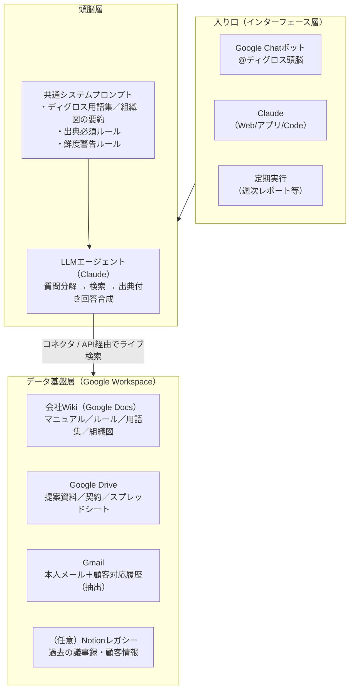

# ディグロス・ブレイン 設計書（v0.1 ドラフト）

「ディグロスの全ての情報にアクセスし、聞けば何でも答えてくれる頭脳」の設計方針をまとめたドキュメント。

---

## 1. 前提：ディグロスの現状（2026-07-14 改訂）

- **情報のハブはGoogle Workspace**（Drive／Docs／スプレッドシート／Gmail／カレンダー）、チャットは**Google Chat**
- **Notionは基本使っていない**（石井確認済み）。ただしNotionワークスペースには過去に作られたイントラページや議事録等のデータが存在する
  - → 本設計はGoogle Workspaceを軸とする。Notion内の有用なデータ（議事録・顧客情報等）は「移行するか、読み取り専用のレガシー情報源として残すか」をPhase 2で判断する
- 日々の業務情報は、Drive上の資料・スプレッドシート・メールに分散して蓄積されている

したがって本プロジェクトの仕事は2つ：**①Google Workspace上の情報を頭脳が引ける形に整えること、②その上に頭脳と入り口（Chatボット）を載せること**。

## 2. 設計の基本方針

### 方針A：頭脳は「作り込む」より「つなぐ」（推奨）

LLMベースの社内Q&Aには大きく2つのアーキテクチャがある。

| 方式 | 仕組み | 長所 | 短所 |
|---|---|---|---|
| ① エージェント検索型 | AIが質問のたびにDrive/Gmail等をライブ検索して回答を合成 | 常に最新／インフラ不要／権限は元システム準拠 | 1回答に数十秒／同時大量利用に不向き |
| ② インデックス型（RAG） | 全文書を事前にベクトルDB化し、検索→LLMで回答 | 速い／大規模利用に強い／横断ランキング可 | 同期パイプラインの構築・運用が必要／権限管理を自前実装／鮮度はバッチ依存 |

**推奨：まず①で始めて、足りなくなったら②を足す。**

理由：①はClaude＋コネクタ（Google Drive / Gmail / カレンダー）で **開発ほぼゼロ** で今日から動く。②を最初から作ると、頭脳の賢さではなく同期・権限・運用の問題に数ヶ月を溶かすことになる。ただしメール全量の検索など大量データはPhase 2〜3でインデックス（②）を併用する。

### 方針B：頭脳の賢さは「データの整備度」で決まる

どんなLLMを使っても、元情報が古い・重複・所在不明なら回答も濁る。Google Workspace上で次を運用ルール化する：

1. **共有ドライブの再設計** — 情報分類レベル（L1〜L4、`ACCESS_CONTROL` §2）に対応した共有ドライブ構成にする。個人マイドライブに会社の資料を置かない
2. **「会社Wiki」をGoogle Docsで作る** — 業務マニュアル・ルール・用語集・組織図を、L1共有ドライブ配下の構造化されたDocs群として整備する（頭脳が最も参照する中核データ）
3. **オーナーと更新日の管理** — 重要文書の一覧（台帳スプレッドシート）にオーナー・最終見直し日を持たせ、古い文書は頭脳が引用時に「情報が古い可能性」と明示
4. **会議の決定事項を残す運用** — 議事録（Docs／Geminiメモ等）から決定事項をWikiに転記する（将来はAIが転記案を自動生成）

### 方針C：回答には必ず出典を付ける

ハルシネーション対策の最重要ルール。「回答＋根拠となるDrive文書／メールへのリンク」をセットで返す設計にし、リンクのない断定は禁止するプロンプト設計とする。人はリンクを踏んで裏を取れる。

### 方針D：権限は元システムに委ねる

①の方式なら、質問者のGoogle Workspace権限で見える情報しか検索されないため、アクセス制御を自前で作らなくてよい。機微情報も共有ドライブの権限設計で制御する。②のインデックスを併用する場合はACLメタデータの同期が必要（`ACCESS_CONTROL` §3）。

## 3. 全体アーキテクチャ

- **データ基盤層**：Google Workspaceを軸に整備。中核は L1共有ドライブ上の「会社Wiki」（Google Docs）
- **頭脳層**：Claude＋コネクタ。「ディグロスの文脈」（用語、組織、事業部の略称、主要顧客名など）を共通システムプロンプトとして整備するのが実質的な開発物
- **インターフェース層**：まずGoogle Chatボット。全員が既にいる場所に頭脳を置くのが利用率を決める

### Google Chatボットの実装方式

SlackのようなClaude公式連携はGoogle Chatにはないため、ここだけ小さな開発が必要になる：

1. Google Cloudプロジェクトで **Google Chat API** のChatアプリを作成
2. 受け口は **Cloud Run**（または Cloud Functions）のHTTPエンドポイント
3. エンドポイント内で **Claude API（Agent SDK）** を呼び、Drive／Docs／Gmail（質問者ごとのユーザーOAuth）を検索させて出典付き回答を返す
4. DM・スペースでの `@メンション` 両対応。長い調査は「調べています…」と先に返してから非同期で回答を投稿

規模感：初版は数百行程度。Workspace内で完結するため追加のSaaS契約は不要（Claude APIの従量課金のみ）。

### Geminiとの使い分け（Google一本化を踏まえた再評価）

情報が全てGoogle Workspaceにあるなら、標準搭載のGeminiで足りる場面は増える。使い分け：
- **Gemini**：個人が自分のDrive/Gmailをサッと検索する用途には最適。追加コストなし。まず全員に使い方を周知する価値がある
- **Claude（本設計の頭脳）**：①複数ソースを跨いで調査・統合する複雑な質問、②Chatボットとして全社共通の入り口・ログ・権限制御・文脈プロンプトを載せる部分、③夜間バッチでの要約・転記などのエージェント業務。ここはモデルの推論力とAPIの柔軟性が効く

つまり「個人の検索はGemini、組織の頭脳はClaude」の併用が現実解。Phase 1の試用でGeminiで十分な質問の比率も確認し、投資判断の材料にする。

## 4. 段階的ロードマップ

### Phase 1（今週〜）：つないで使い始める — 開発ゼロ
- Claude（Team/Enterprise）にGoogle Drive・Gmail・カレンダーコネクタを接続
- 経営陣・マネージャー数名で試用し、「答えられなかった質問」を記録する（→これが後のデータ整備とPhase 2の要件になる）
- 成果物：使い方1ページ＋「ディグロス文脈プロンプト」v1（プロジェクト機能に設定）

### Phase 2（1〜2ヶ月）：全社の入り口を作る
- **Google Chatボット化**：Chat API＋Cloud Run＋Claude Agent SDKで自前ボット（`@頭脳 ○○様の契約形態は？`）。実装方式は§3参照
- **ディグロス文脈プロンプトの育成**：Phase 1で拾った用語・言い換え（例：「SP」=セールスパートナー）を辞書化
- **データ整備スプリント**：答えられなかった質問の原因を特定し、会社Wikiの追記・共有ドライブ再編・文書台帳の運用を敷く
- **評価セットの作成**：「正しく答えてほしい質問50問＋模範解答」を作り、変更のたびに回答品質を測る

### Phase 3（必要になったら）：RAGインデックス増設
以下の兆候が出たらインデックス型（②）を検討する。出なければ作らない：
- 回答まで数十秒が業務上許容できない用途が出た（例：顧客対応中の即答）
- コネクタで届かない情報源（基幹システム、契約書PDF群、通話ログ等）を入れたい
- 利用量が増えライブ検索のコスト・レート制限が問題化

構成案：情報源→ETL（増分同期）→チャンク化→ハイブリッド検索（ベクトル＋キーワード）→リランク→Claude合成。権限はソース側ACLをインデックスのメタデータに同期。

### Phase 3.5+：受け身の頭脳から、働く頭脳へ
Q&Aが安定したら「聞かれる前に動く」機能を足す：
- 週次で全議事録を読んで経営サマリーを自動作成
- 決定事項の自動抽出→会社Wikiへの転記提案
- 見直し期限切れ文書のオーナーへの督促

## 5. リスクと対策

| リスク | 対策 |
|---|---|
| もっともらしい嘘（ハルシネーション） | 出典リンク必須。見つからなければ「見つからなかった」と答えさせる |
| 機微情報の漏出（給与・評価・顧客機密） | 権限は元システム準拠（方針D）。頭脳用の全権アカウントを作らない |
| 使われない | Google Chatという既存動線に置く。経営陣が率先して使い、回答をシェアする |
| 情報が古い | 文書台帳（オーナー・見直し日）の運用＋回答時の鮮度警告 |
| ベンダーロックイン | 頭脳層は薄く保つ（資産は「整備されたGoogle Workspace」と「文脈プロンプト」「評価セット」に置く。これらはどのLLMにも移植可能） |

## 6. 最初の一歩（チェックリスト）

- [ ] ClaudeにGoogle Drive／Gmail／カレンダーコネクタを接続し、経営陣で1週間試す
- [ ] 「答えられなかった質問」ログを作る（スプレッドシート1枚）
- [ ] ディグロス文脈プロンプト v1 を書く（用語集・組織・事業部概要 各10行程度）
- [ ] 評価用の質問リスト作成を開始（まず10問でよい）
- [ ] 会社Wiki（Google Docs）の骨格を作る — まず頻出質問トップ20に答えられる分から
- [ ] 共有ドライブのL1〜L4再編と権限棚卸しに着手する（`ACCESS_CONTROL` §5）
