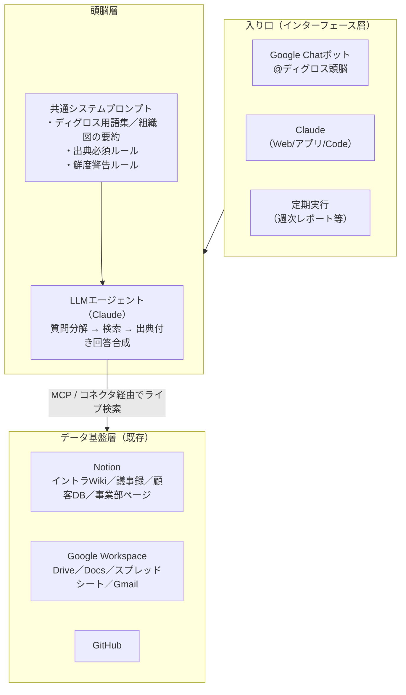

# ディグロス・ブレイン 設計書（v0.1 ドラフト）

「ディグロスの全ての情報にアクセスし、聞けば何でも答えてくれる頭脳」の設計方針をまとめたドキュメント。

---

## 1. 前提：ディグロスの現状

設計にあたり、現在の情報環境を確認した。

- **Notionが情報のハブになっている**
  - 「🌿 ディグロス_イントラ」Wikiデータベースに全社情報を集約する方針が既にある（タグ：拠点一覧／人事・労務／ポリシー／ビジョン／会社の最新情報、オーナー、有効期限＝Verification付き）
  - 事業部ページ（SP事業部、コラパス事業部、カスタマーグロース等）、事業計画、業務フロー
  - AI議事録（顧客MTG・社内MTGのミーティングノートが日々蓄積）
  - 導入顧客管理などの顧客DB
- **社内ツールはGoogle Workspace**（Drive／Docs／スプレッドシート／Gmail／カレンダー）、チャットは**Google Chat**
  - Google DriveはNotionコネクタやClaudeコネクタで横断検索の対象にできる

つまり「情報を1箇所に集める」というデータ基盤の思想は既にあり、足りないのは **「その上に載せる頭脳と、聞くための入り口」** である。

## 2. 設計の基本方針

### 方針A：頭脳は「作り込む」より「つなぐ」（推奨）

LLMベースの社内Q&Aには大きく2つのアーキテクチャがある。

| 方式 | 仕組み | 長所 | 短所 |
|---|---|---|---|
| ① エージェント検索型 | AIが質問のたびにNotion/Slack等をライブ検索して回答を合成 | 常に最新／インフラ不要／権限は元システム準拠 | 1回答に数十秒／同時大量利用に不向き |
| ② インデックス型（RAG） | 全文書を事前にベクトルDB化し、検索→LLMで回答 | 速い／大規模利用に強い／横断ランキング可 | 同期パイプラインの構築・運用が必要／権限管理を自前実装／鮮度はバッチ依存 |

**推奨：まず①で始めて、足りなくなったら②を足す。**

理由：①はClaude＋コネクタ（Notion / Google Drive / Gmail / カレンダー）で **開発ほぼゼロ** で今日から動く。実際、この設計書自体がその方式（ClaudeがNotionをライブ検索）で書かれており、実用に足ることが実証済み。②を最初から作ると、頭脳の賢さではなく同期・権限・運用の問題に数ヶ月を溶かすことになる。

### 方針B：頭脳の賢さは「データの整備度」で決まる

どんなLLMを使っても、元情報が古い・重複・所在不明なら回答も濁る。イントラDBに既にある仕組みを運用ルール化する：

1. **有効期限（Verification）の運用** — 重要ページはオーナーが定期的に「検証済み」を更新。期限切れページは頭脳が引用時に「情報が古い可能性」と明示
2. **タグとオーナーの必須化** — 全ページに責任者を置く
3. **「会議で決まったこと」を議事録から意思決定ログへ昇格させる運用** — 議事録は生データ、決定事項はイントラに転記（これはAIに自動化させられる）

### 方針C：回答には必ず出典を付ける

ハルシネーション対策の最重要ルール。「回答＋根拠となるNotionページへのリンク」をセットで返す設計にし、リンクのない断定は禁止するプロンプト設計とする。人はリンクを踏んで裏を取れる。

### 方針D：権限は元システムに委ねる

①の方式なら、質問者のNotion／Google Workspace権限で見える情報しか検索されないため、アクセス制御を自前で作らなくてよい。人事評価・給与などの機微情報を扱い始める場合もNotion側の権限設計で制御する。②に移行する場合はここが最大の設計課題になる（ACLの同期が必要）。

## 3. 全体アーキテクチャ

- **データ基盤層**：新規構築しない。Notionを知識のハブとし、Google Drive等はNotionコネクタまたはClaudeコネクタで接続
- **頭脳層**：Claude＋MCP。「ディグロスの文脈」（用語、組織、事業部の略称、主要顧客名など）を共通システムプロンプトとして整備するのが実質的な開発物
- **インターフェース層**：まずGoogle Chatボット。全員が既にいる場所に頭脳を置くのが利用率を決める

### Google Chatボットの実装方式

SlackのようなClaude公式連携はGoogle Chatにはないため、ここだけ小さな開発が必要になる：

1. Google Cloudプロジェクトで **Google Chat API** のChatアプリを作成
2. 受け口は **Cloud Run**（または Cloud Functions）のHTTPエンドポイント
3. エンドポイント内で **Claude API（Agent SDK）** を呼び、Notion MCP・Google Drive（サービスアカウント or ユーザーOAuth）を検索させて出典付き回答を返す
4. DM・スペースでの `@メンション` 両対応。長い調査は「調べています…」と先に返してから非同期で回答を投稿

規模感：初版は数百行程度。Workspace内で完結するため追加のSaaS契約は不要（Claude APIの従量課金のみ）。

補足：Google Workspaceに標準搭載の **Gemini** はDrive/Gmail横断の質問には手軽だが、知識のハブであるNotionを検索できないため、本設計の頭脳はClaude＋Notion MCPを軸とし、Geminiは個人のWorkspace内検索の補助と位置付ける。

## 4. 段階的ロードマップ

### Phase 1（今週〜）：つないで使い始める — 開発ゼロ
- Claude（Team/Enterprise）にNotion・Google Drive・Gmail・カレンダーコネクタを接続
- 経営陣・マネージャー数名で試用し、「答えられなかった質問」を記録する（→これが後のデータ整備とPhase 2の要件になる）
- 成果物：使い方1ページ＋「ディグロス文脈プロンプト」v1（プロジェクト機能に設定）

### Phase 2（1〜2ヶ月）：全社の入り口を作る
- **Google Chatボット化**：Chat API＋Cloud Run＋Claude Agent SDKで自前ボット（`@頭脳 ○○様の契約形態は？`）。実装方式は§3参照
- **ディグロス文脈プロンプトの育成**：Phase 1で拾った用語・言い換え（例：「SP」=セールスパートナー）を辞書化
- **データ整備スプリント**：答えられなかった質問の原因ページを特定し、イントラDBのタグ・オーナー・Verification運用を敷く
- **評価セットの作成**：「正しく答えてほしい質問50問＋模範解答」を作り、変更のたびに回答品質を測る

### Phase 3（必要になったら）：RAGインデックス増設
以下の兆候が出たらインデックス型（②）を検討する。出なければ作らない：
- 回答まで数十秒が業務上許容できない用途が出た（例：顧客対応中の即答）
- コネクタで届かない情報源（基幹システム、契約書PDF群、通話ログ等）を入れたい
- 利用量が増えライブ検索のコスト・レート制限が問題化

構成案：情報源→ETL（増分同期）→チャンク化→ハイブリッド検索（ベクトル＋キーワード）→リランク→Claude合成。権限はソース側ACLをインデックスのメタデータに同期。

### Phase 3.5+：受け身の頭脳から、働く頭脳へ
Q&Aが安定したら「聞かれる前に動く」機能を足す：
- 週次で全議事録を読んで経営サマリーを自動作成
- 決定事項の自動抽出→イントラへの転記提案
- 期限切れVerificationページのオーナーへの督促

## 5. リスクと対策

| リスク | 対策 |
|---|---|
| もっともらしい嘘（ハルシネーション） | 出典リンク必須。見つからなければ「見つからなかった」と答えさせる |
| 機微情報の漏出（給与・評価・顧客機密） | 権限は元システム準拠（方針D）。頭脳用の全権アカウントを作らない |
| 使われない | Google Chatという既存動線に置く。経営陣が率先して使い、回答をシェアする |
| 情報が古い | Verification運用＋回答時の鮮度警告 |
| ベンダーロックイン | 頭脳層は薄く保つ（資産は「整備されたNotion」と「文脈プロンプト」「評価セット」に置く。これらはどのLLMにも移植可能） |

## 6. 最初の一歩（チェックリスト）

- [ ] ClaudeにNotion／Google Drive／Gmailコネクタを接続し、経営陣で1週間試す
- [ ] 「答えられなかった質問」ログを作る（Notionに1DB）
- [ ] ディグロス文脈プロンプト v1 を書く（用語集・組織・事業部概要 各10行程度）
- [ ] 評価用の質問リスト作成を開始（まず10問でよい）
- [ ] イントラDBの全ページにオーナーを設定する
